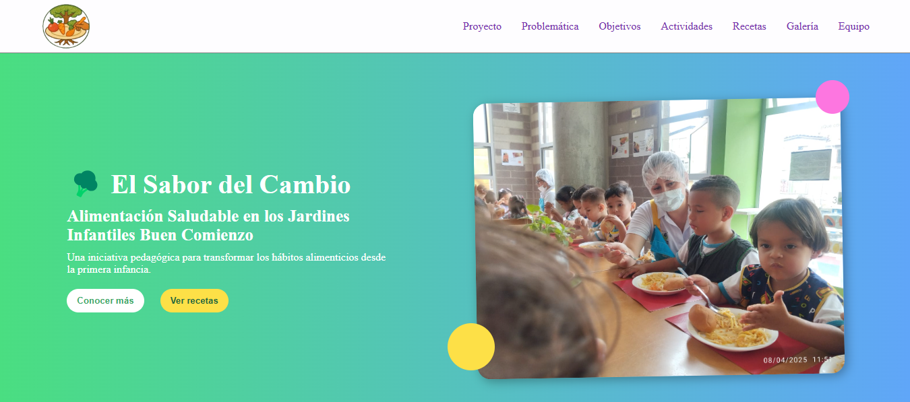

# 🌈 ¡El Sabor del Cambio! 🍎



Un proyecto colorido y animado para instructoras infantiles.

## 🥦 Descripción

Blog moderno diseñado para instructoras infantiles, con un enfoque vibrante y alegre.

## 📂 Organización de Carpetas

├── assets/
│   ├── img/
│   └── styles/
│       └── style.css
├── index.html
└── README.md

## ⚙️ Instalación y Ejecución

1.  **Clona el repositorio:**
    ```bash
    git clone [https://github.com/sxntiBG/ElSaborDelCambio](https://github.com/sxntiBG/ElSaborDelCambio)
    ```
2.  **Navega al directorio del proyecto:**
    ```bash
    cd ElSaborDelCambio
    ```
3.  **Abre el archivo `index.html` en tu navegador web.**

## 🔗 Link del Demo

[¡Explora el demo!](https://sxntibg.github.io/ElSaborDelCambio/)